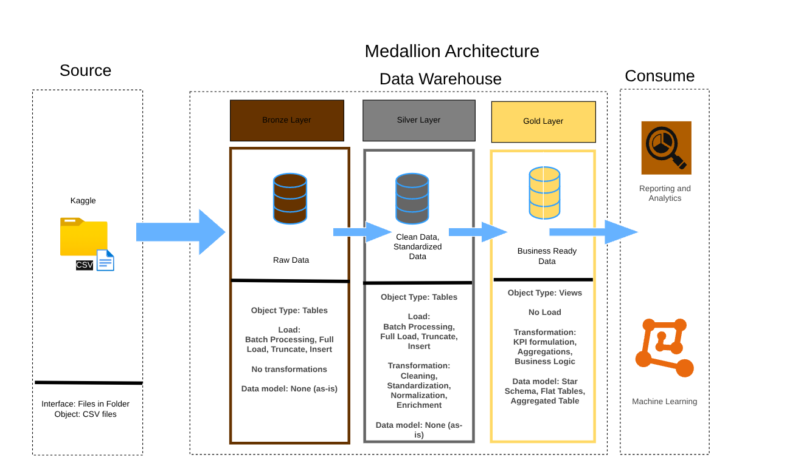
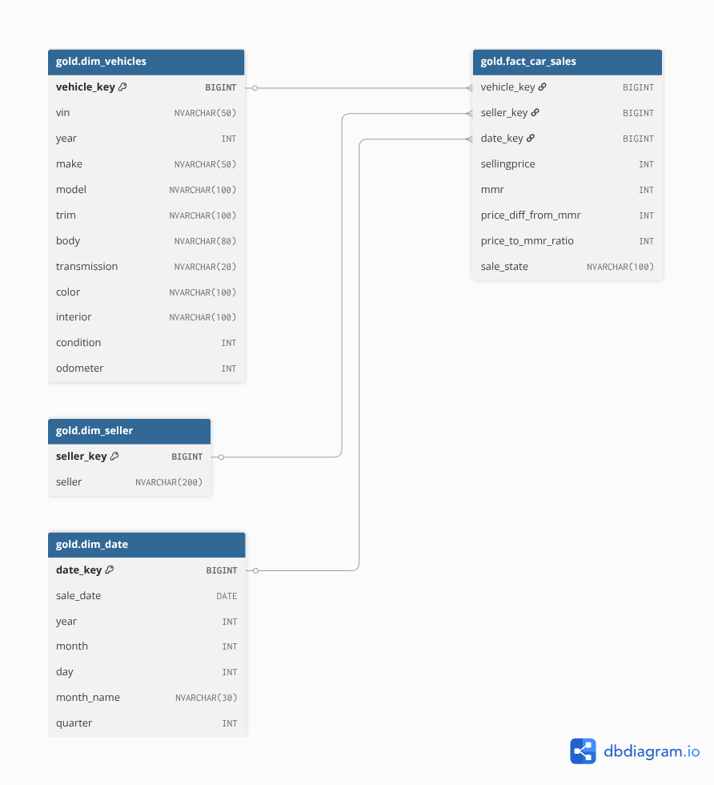

# Vehicle Sales Data Warehouse Project

## 📌 Project Overview
This project involves the design and implementation of a data warehouse using SQL Server Management Studio (SSMS), based on a comprehensive Vehicle Sales and Market Trends Dataset. The purpose of this data warehouse is to consolidate, organize, and optimize vehicle sales data from to support data-driven decision-making across sales, operations, and business strategy. It enables historical analysis, trend forecasting, and performance benchmarking related to vehicle sales, sellers, pricing, and market value (MMR) primarily especially for Auto insurers who may use vehicle condition, age, and sales data to improve claims valuation or adjust premiums based on real-world resale value trends.

## 🗃️ Dataset Description
The source [`dataset`](https://www.kaggle.com/datasets/syedanwarafridi/vehicle-sales-data) includes detailed vehicle sales transactions with the following fields:

Vehicle Attributes: Year, Make, Model, Trim, Body Type, Transmission, Exterior/Interior Color, VIN

Sales Data: Sale Date, Selling Price, Seller Information, State of Sale

Condition & Usage: Odometer Reading, Condition Rating

Market Value: Manheim Market Report (MMR) Values

## 🧱 Data Warehouse Architecture

### Medallion Architecture

The data architecture for this project follows Medallion Architecture Bronze, Silver, and Gold layers:

* Bronze Layer (has stored procedure): Stores raw data as-is from the source systems. Data is ingested from CSV Files into SQL Server Database.
* Silver Layer (has stored procedure): This layer includes data cleansing, standardization, and normalization processes to prepare data for analysis.
* Gold Layer: Contains business-ready data modeled into a star schema required for reporting and analytics and ML purposes.

### 🏗️ Schema Design: Star Schema for Car Pricing

Fact Table:

* gold.fact_car_sales

Dimensions:

* gold.dim_vehicle

* gold.dim_seller

* gold.dim_date

#### Relationship

## ⚙️ ETL Process
1. Extract
Raw CSV data loaded using SSMS.

2. Transform
Data cleaning: deduplication, type casting, NULL handling

Dimension normalization: distinct values loaded into dimension tables

Surrogate key creation for dimensions

3. Load
Transformed data loaded into fact and dimension tables

Referential integrity enforced using foreign keys

