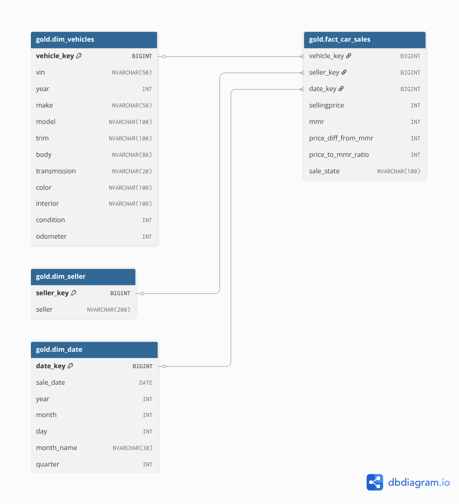
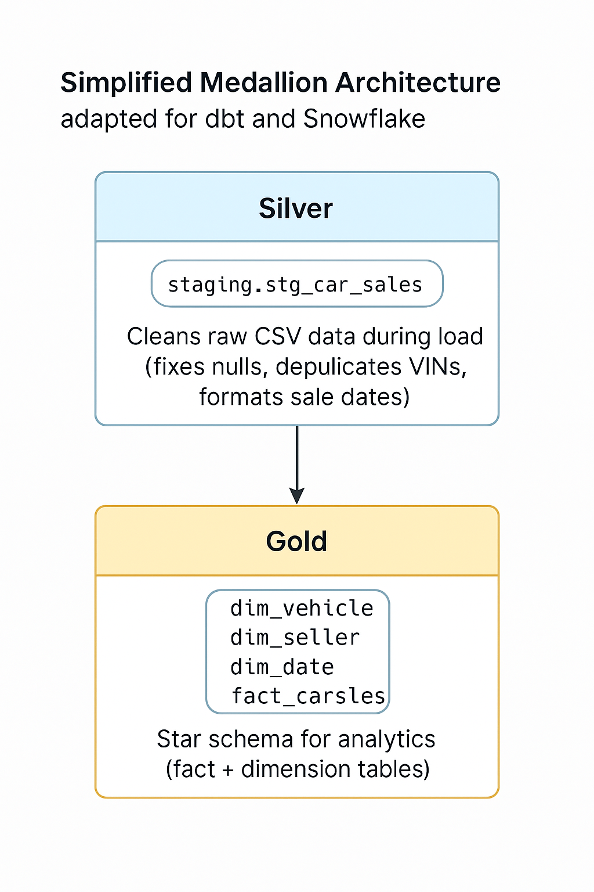

Welcome to your new dbt project!

### Using the starter project

Try running the following commands:
- dbt run
- dbt test

# 🚗 Vehicle Sales Data Warehouse (Snowflake + dbt)

This project is a modern revamp of my original SQL Server-based vehicle sales analysis pipeline. It implements a **cloud-native data warehouse** using **Snowflake** and **dbt (data build tool)**, structured with the **Medallion Architecture** (Bronze, Silver, Gold) to enable clean, scalable, and auditable analytics workflows.

---

## 📌 Project Purpose

The purpose of this data warehouse is to consolidate, organize, and optimize vehicle sales data from to support data-driven decision-making across sales, operations, and business strategy. It enables historical analysis, trend forecasting, **data-driven insights** and performance benchmarking related to vehicle sales, sellers, pricing, and market value (MMR) primarily especially for **Auto insurers** who may use vehicle condition, age, and sales data to improve claims valuation or adjust premiums based on real-world resale value trends

---

## 🧰 Tools & Technologies

| Tool          | Purpose |
|---------------|---------|
| **Snowflake** | Cloud data warehouse for scalable storage and compute |
| **dbt**       | Transformation layer — modeling, testing, and documentation |
| **Git/GitHub**| Version control and collaboration |
| **VS Code**   | Development environment |
| **[`Kaggle Dataset`](https://www.kaggle.com/datasets/syedanwarafridi/vehicle-sales-data)**| Source data containing detailed car sales records |

---

## 🗃️ Data Model (Star Schema)

The warehouse follows a **star schema** design:

### 📂 Fact Table:
- `fact_car_sales`: Core metrics such as selling price, price-to-MMR ratio, and foreign key references to dimensions.

### 📂 Dimension Tables:
- `dim_vehicle`: Unique vehicles by VIN
- `dim_seller`: Distinct seller profiles
- `dim_date`: Calendar date dimension for temporal analysis

### Diagram


---

## 🏗️ Architecture

This project follows a simplified **Medallion-style architecture** adapted for dbt and Snowflake:

| Layer | Folder      | Description |
|-------|-------------|-------------|
| Silver | `models/staging/` | Cleans raw CSV data during load (fixes nulls, deduplicates VINs, formats sale dates) |
| Gold   | `models/gold/`    | Star schema for analytics (fact + dimension tables) |

### Diagram


> dbt pipeline started at the Silver layer

---

## ⚙️ ELT Workflow with dbt

- `car_prices.csv`: Raw data loaded into Snowflake table (Bronze)
- `stg_car_sales.sql`: Silver stage
- `dim_vehicle`, `dim_seller`, `dim_date`, `fact_car_sales`: Gold-layer models

All transformations are **declarative** and **version-controlled** using dbt, with automated tests (e.g. not-null, uniqueness) and dependency tracking via `ref()`.

## 📂 Folder Structure
``` Vehicle_Analysis_wh/
├── models/
│ ├── staging/
│ │ ├── sources.yml # Source definition for raw car sales CSV
│ │ └── stg_car_sales.sql # Raw cleaned-up staging model
│ └── gold/
│ ├── dim_date.sql # Date dimension
│ ├── dim_seller.sql # Seller dimension
│ ├── dim_vehicles.sql # Vehicle dimension
│ └── fact_car_sales.sql # Fact table with price, MMR metrics
├── macros/ # Custom Jinja macros (if needed)
├── analyses/ # Optional ad hoc analysis queries
├── dbt_project.yml # Main dbt project config
```
> This project uses dbt’s recommended directory structure for model organization

---

## 📈 Future Enhancements

- Add dbt docs and data lineage diagrams
- Integrate Snowflake’s native tasks & streams for incremental loading
- Build Tableau or Streamlit dashboard for real-time insights
- Schedule automated runs via dbt Cloud or Airflow

---


### Resources:
- Learn more about dbt [in the docs](https://docs.getdbt.com/docs/introduction)
- Check out [Discourse](https://discourse.getdbt.com/) for commonly asked questions and answers
- Join the [chat](https://community.getdbt.com/) on Slack for live discussions and support
- Find [dbt events](https://events.getdbt.com) near you
- Check out [the blog](https://blog.getdbt.com/) for the latest news on dbt's development and best practices
